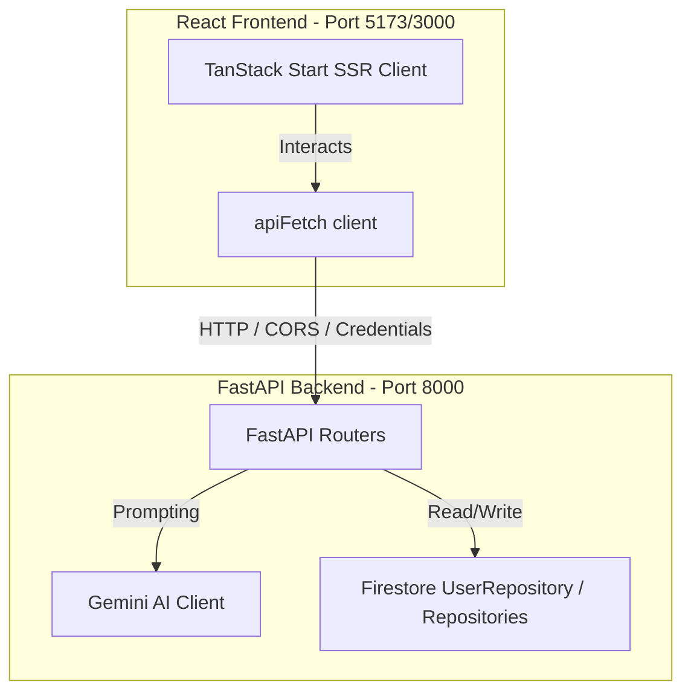

# Healthbox (v3.0)

Healthbox is an intelligent healthcare platform designed to streamline patients' medical journeys. It offers symptoms triage (powered by Gemini AI), digital medical records tracking, hospital and pharmacy discovery, government scheme recommendations, and an AI chat assistant.

---

## 🏗️ Architecture Overview

The system is structured as a decoupled monorepo containing a React/TypeScript frontend and a FastAPI/Python backend:



- **Frontend**: Built with **React 19**, **Vite 8**, **TypeScript**, **TanStack Start** (for Server-Side Rendering and file-based routing), and styled using **Tailwind CSS v4** + **shadcn/ui**.
- **Backend**: Built with **FastAPI**, **Uvicorn**, **Pydantic v2**, using **Firestore** as the primary datastore and the **Google GenAI SDK** for triage analysis and chat services.

---

## 📂 Directory Layout

```
healthbox_3.0/
├── backend/               # FastAPI Python application
│   ├── app/               # Application logic (routers, models, repositories)
│   │   ├── routers/       # REST API endpoints (auth, chat, records, etc.)
│   │   ├── repositories/  # Database access layer (Firestore)
│   │   ├── services/      # Business logic services
│   │   └── models.py      # Pydantic schema declarations
│   ├── .env               # Environment configuration file
│   └── requirements.txt   # Python package dependencies
├── frontend/              # Vite / React web application
│   ├── src/
│   │   ├── routes/        # TanStack Router file-based pages
│   │   ├── components/    # Common UI and layout components
│   │   ├── lib/           # Contexts, utilities, and API client (api.ts)
│   │   └── styles.css     # Global stylesheets (Tailwind v4)
│   └── package.json       # JS dependencies and run scripts
├── start.sh               # Unified startup script (Local & LAN support)
└── README.md              # Root documentation (this file)
```

---

## 🚀 Quick Start (Recommended)

The easiest way to start both the frontend and backend concurrently is using the unified bash script `start.sh` in the root directory.

### Prerequisite Checklist
1. **Python 3.10+**: Ensure Python is installed.
2. **Node.js or Bun**: Install [Bun](https://bun.sh/) (preferred) or Node.js.
3. **Environment setup**: Make sure `backend/.env` is set up (refer to `backend/.env.example`) with your Firestore credentials and Google Gemini API keys.

### Running the Application

1. Make the startup script executable:
   ```bash
   chmod +x start.sh
   ```

2. **Localhost Mode** (Runs on `localhost` loopback interface):
   ```bash
   ./start.sh
   ```
   *Frontend is accessible at http://localhost:5173.*

3. **LAN Mode** (Runs on your network IP, allowing other devices on the same Wi-Fi/LAN to access it):
   ```bash
   ./start.sh --lan
   ```
   *The console will print your local network IP (e.g. `http://192.168.1.10:5173`) which you can open on smartphones, tablets, or other computers.*

To stop both servers, simply press `Ctrl + C` in the terminal. The script will automatically clean up all background processes.

---

## 🔧 Standalone Setup

If you prefer to run the applications manually in separate terminals, refer to their respective documentation:

- 🛡️ **Backend Setup & API Reference**: [backend/README.md](file:///home/yashesh/biothon/healthbox_3.0/backend/README.md)
- 🎨 **Frontend Routing & Components**: [frontend/README.md](file:///home/yashesh/biothon/healthbox_3.0/frontend/README.md)
